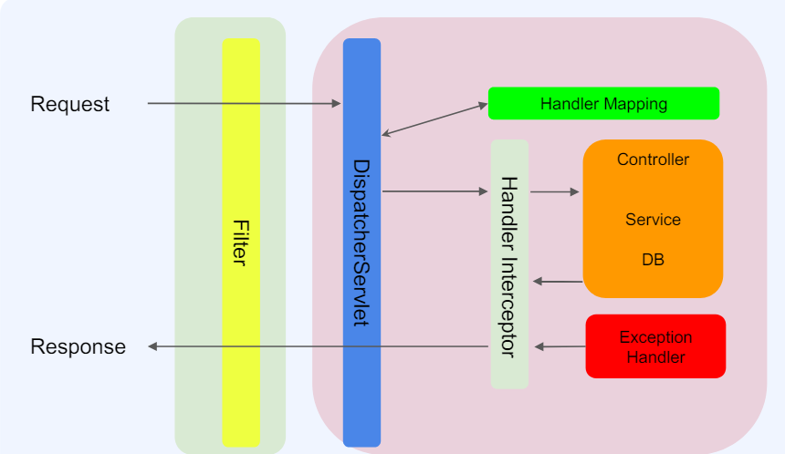

# Chapter9

## filter

- 클라이언트가 어떤 데이터를 보냈는지 로우한 json을 찍어 볼 수 있다.
- 클라이언트가 데이터를 잘 못 보냈을 경우에 확인 할 수 있어야 한다. 

## interceptor
- 주로 인증관련 처리를 많이 한다.
    - 정상적인 데이터가 왔는지? 등..
- 핸들러 인터셉트를 통한 데이터 인터셉트하기

## AOP(Aspect Oriented Programming)
관점 지향 프로그램

스프링 어플리케이션은 대부분 특별한 경우를 제외하고는 mvc 웹 어플리케이션에서는 
Web Layer, Business Layer, Data Layer 로 정의 

